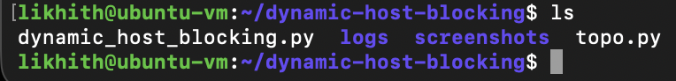
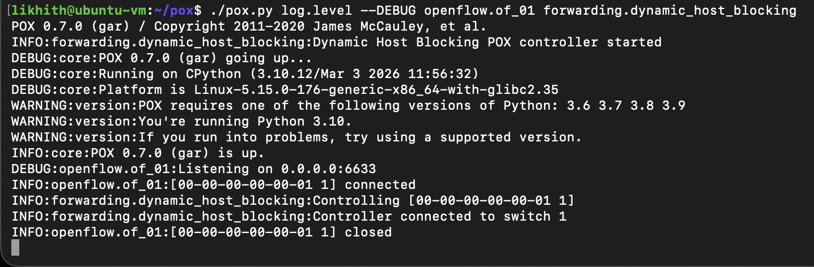
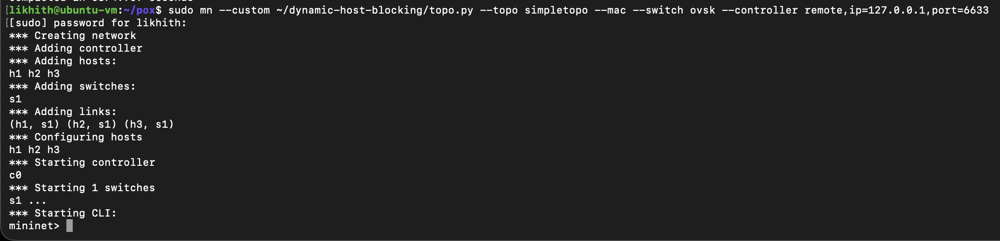
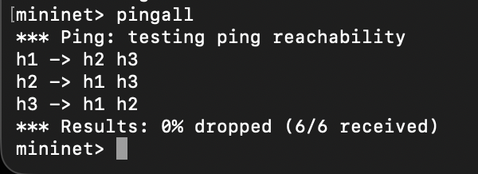
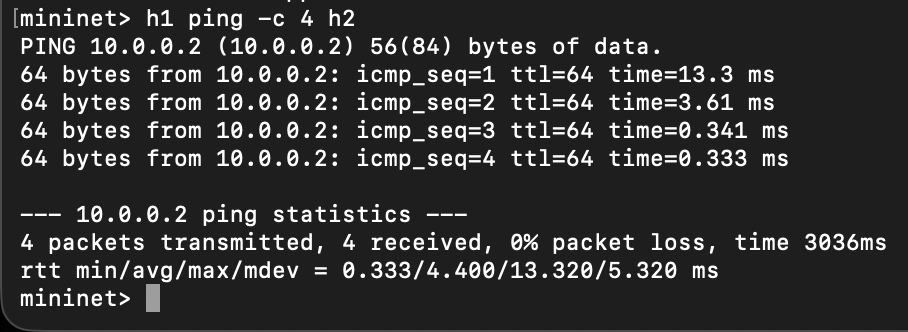
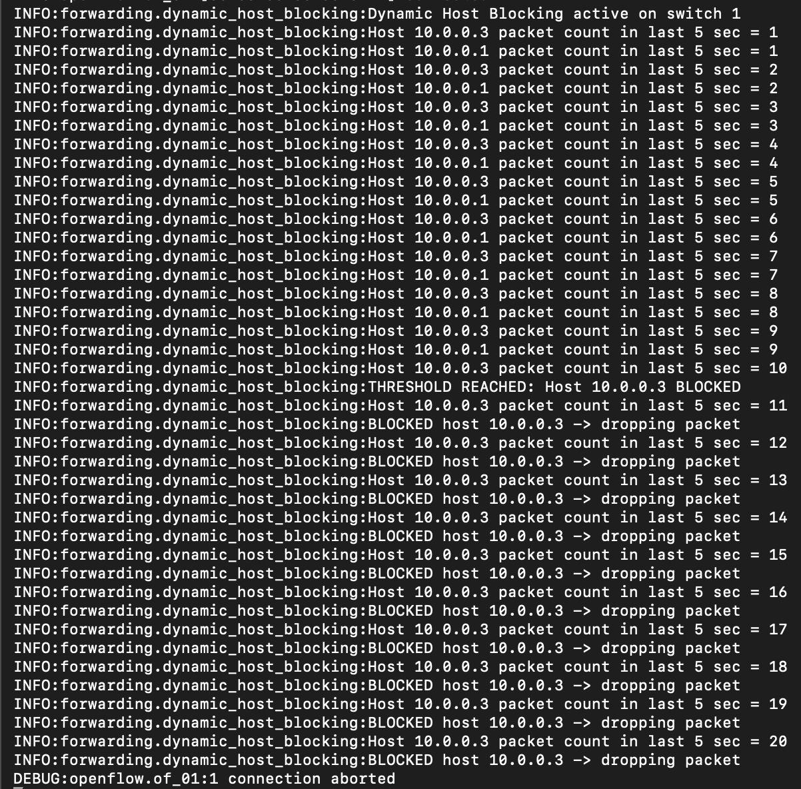
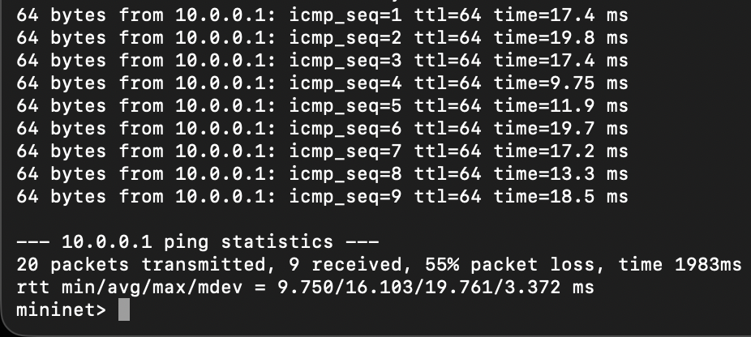
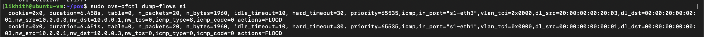
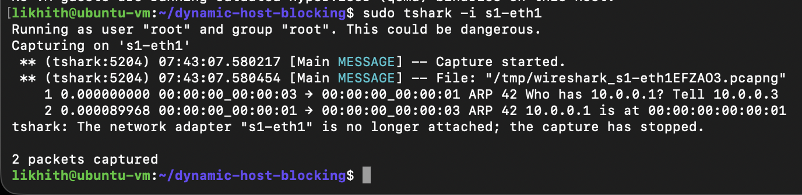
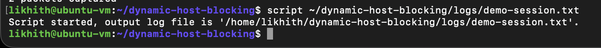

# Dynamic Host Blocking System using POX and Mininet

## Problem Statement
This project implements a Dynamic Host Blocking System in Software Defined Networking using POX controller and Mininet. The controller monitors host traffic and blocks suspicious hosts by installing OpenFlow drop rules.

## Objective
Detect abnormal traffic behavior from a host and dynamically block that host using SDN flow rules.

## Topology
1 switch (s1), 3 hosts (h1, h2, h3).

## Requirements
- Ubuntu 22.04
- Mininet
- Open vSwitch
- POX controller
- Python 3

## Setup
```bash
sudo apt update
sudo apt install -y git python3 python3-pip openvswitch-switch mininet wireshark tshark
cd ~
git clone https://github.com/noxrepo/pox.git
```

Copy your project files:
```bash
cp ~/dynamic-host-blocking/dynamic_host_blocking.py ~/pox/pox/forwarding/
cp ~/dynamic-host-blocking/topo.py ~/dynamic-host-blocking/
```

## Execution
### Start controller
```bash
cd ~/pox
./pox.py log.level --DEBUG openflow.of_01 forwarding.dynamic_host_blocking
```

### Start topology
```bash
sudo mn --custom ~/dynamic-host-blocking/topo.py --topo simpletopo --mac --switch ovsk --controller remote,ip=127.0.0.1,port=6633
```

## Test Scenario 1: Normal traffic
```bash
h1 ping -c 4 h2
```
Expected output: ping success.

## Test Scenario 2: Suspicious traffic and blocking
```bash
h3 ping -c 20 -i 0.1 h1
```
Expected output: controller detects abnormal traffic, logs host blocking, and h3 traffic gets dropped.

## Flow Table Verification
```bash
sudo ovs-ofctl dump-flows s1
```
Expected output: a high-priority flow entry matching the blocked host IP with drop behavior.

## Proof of Execution
The screenshots below show the full workflow: project folder, controller startup, Mininet topology, normal connectivity, blocking detection, packet loss after blocking, flow table output, tshark proof, and session logging.

### 1. Project Folder


### 2. POX Controller Start


### 3. Mininet Topology Start


### 4. Suspicious Traffic Run


### 5. Blocking Detected in POX


### 6. Ping Loss After Blocking


### 7. Pingall Result


### 8. Normal Ping Between h1 and h2


### 9. Flow Table Dump


### 10. tshark Capture


### 11. Demo Session Log


## Expected Output
- POX starts and connects to the Mininet switch.
- Mininet creates a working topology with s1, h1, h2, and h3.
- Normal traffic between h1 and h2 works.
- h3 triggers the threshold and gets blocked dynamically.
- Ping from h3 starts failing or shows packet loss after the block.
- Flow table shows the blocking rule for the suspicious host.

